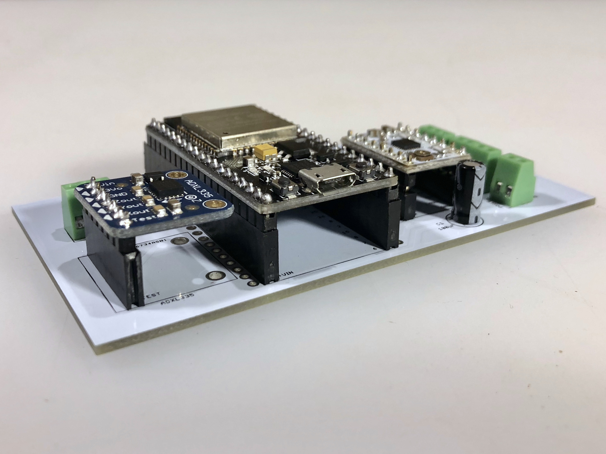

## Assembling the Electronics

### PCB Layout

We designed the layout of the PCB to allow you to extend the conveyor with additional sensors or actuators. We have broken out each pin of the ESP32 and provide a solderable breadboard area at the top right of the board. This breadboard area has a ground and 3.3V rails you can use to power your sensors.

### PCB Assembly
The PCB is populated with the following components:
* ESP32 micro-controller
* DRV8834 Stepper Motor Controller
* ADXL335 Accelerometer
* 100uF Capacitor
* Screw Terminals

While the ESP32, DRV8834, and ADXL335 can all be directly soldered to the board, we suggest soldering 2.54MM female headers instead. Doing this allows you to replace the components incase of failure.

Depending on the version of the ESP32, DRV8834, and ADXL335 you purchase, you will need to first solder male 2.54MM headers on to each device before assembling it onto the conveyor.

Finished Top View:

Finished Front View (note headers):

### DRV8834 Stepper Motor Controller Setup
Before we can use the DRV8834 we will need to set the current limit on the device for the particular stepper motor you are using for the conveyor. On the product page for the DRV8834 is a current limiting section that details how to perform this operation: [DRV8834 Product Page](https://www.pololu.com/product/2134). This process involves turning the trimmer potentiometer on the DRV8834 until a the voltage reference reaches the proper value. In the case of the Zyltech NEMA 17 Stepper Motor it runs at a maximum of 1.5 amps so the voltage reference on the DRV8834 should be set no more than 0.75V (we chose 0.7V and it seems to work fine). If you use a different motor you will need to make sure this value does not exceed the max amperage of the motor.   

