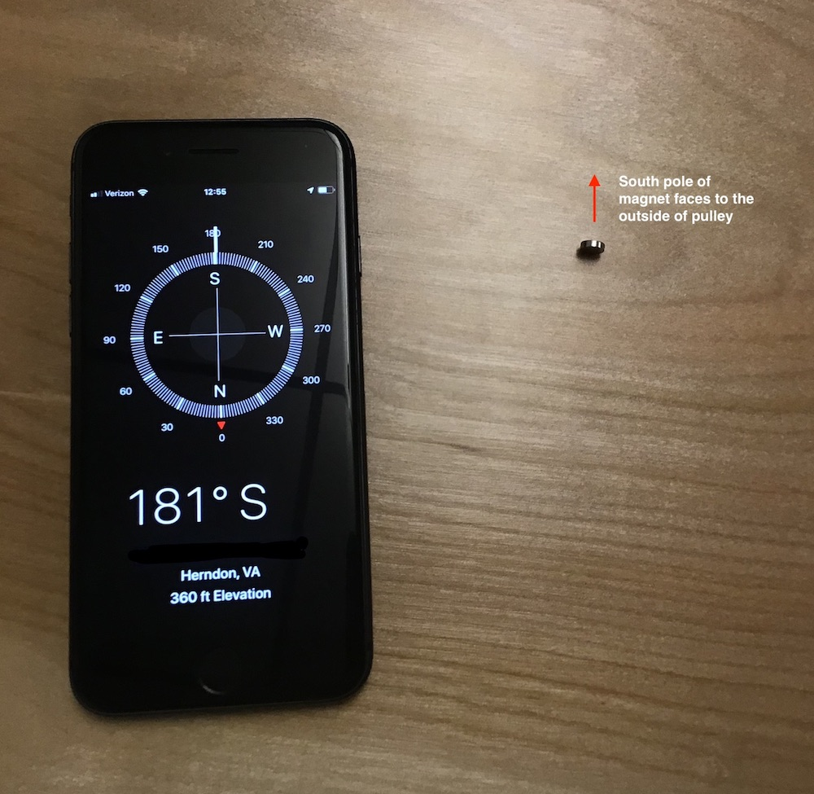
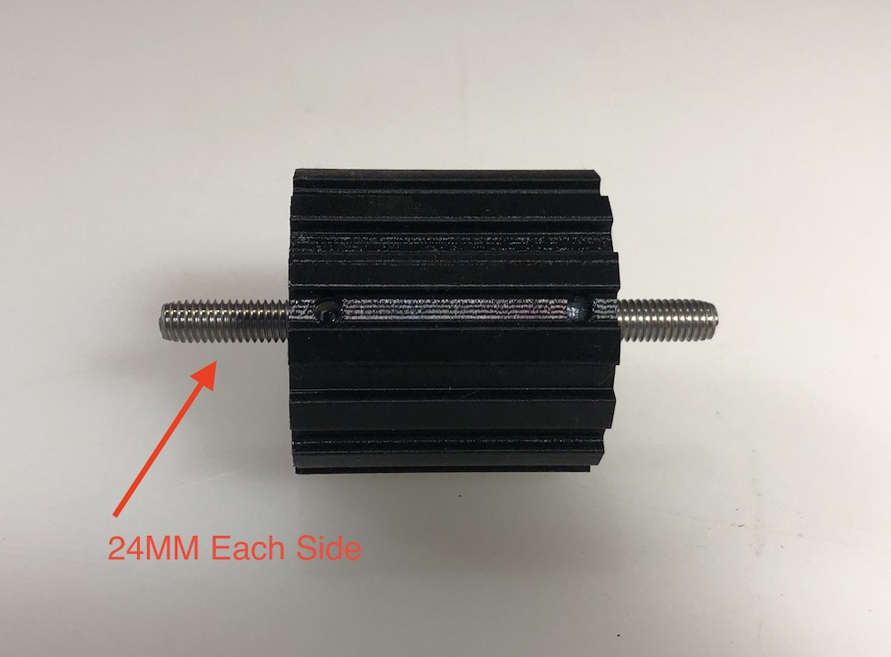
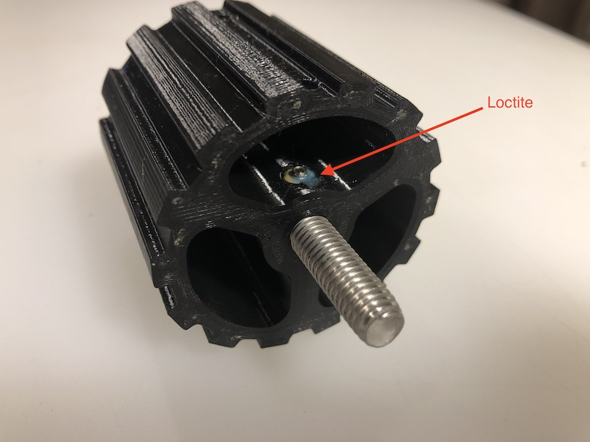

# Belt Pulley Subassemblies
The belt pulley subassembly consists of three steps:

* Install magnets for RPM sensing.
* Attaching 100mm threaded rod (axle) to pulley.

## Magnets
We use small 6mm magnets embedded in one of the belt pulleys to detect RPMs. In a separate section we detail the Hall Effect sensor that is used to sense the magnetic fields from the rotating pulley. The South face of the magnet is what will trigger the Hall Effect sensor so you will need to make sure that face oriented outward from the pulley. To figure out what side if the magnet is South, open up your smart phone's compas application and set your phone on a flat surface facing south. Stand one of the 6mm magents on end, if the surface is smooth the magenet should spin until it is oriented on a North/South axis.   Mark the side that is facing South, this is the side that will face outward on the pulley.

Depending on how you printed this part you may need to chamfer the inner edge of the sockets so the magnets can be pressed in. Note it will be much easier to install the magnets without the M8 threaded axel installed. 

## Installing 100mm M8 Threaded Axle

The axle for each pulley is a 100mm long M8 threaded axle. To center it in the pulley you should have 24mm sticking out of each side.

To fix the axle in the pulley use M3 set screws in each of the heat set inserts. Tighten the set screws snugly but make sure you don't force the heat set inserts out of the pulley with too much force. I put a drop of Loctite on each set screw so they don't blackout during use. 

